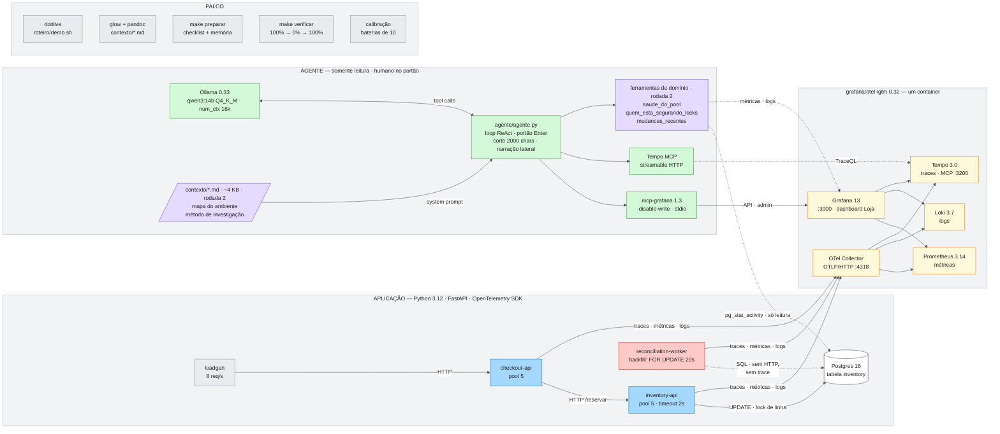

# Arquitetura da POC

Tudo roda num MacBook M3 Pro de 18 GB. Nada sai da máquina. Versões em
`make stack`; o desenho editável está em `arquitetura.excalidraw`.

## Como ler

- **O worker é o culpado e não aparece em nenhum trace da requisição** (linha
  tracejada vermelha): fala SQL direto com o mesmo Postgres. Quem segue o trace
  para no inventory-api.
- **Rodada 1:** o agente tem só `mcp-grafana` + Tempo MCP, 5 ferramentas
  genéricas, nenhuma informação sobre o ambiente. Em 90 execuções nunca nomeou
  o worker.
- **Rodada 2:** entram `contexto/*.md` (mapa + método, ~4 KB) e as três
  ferramentas de domínio. 10/10 nomeia o worker, a flag e os locks, em ~1 min.
- **Ablação** (`calibracao/ABLACAO.md`): só o mapa, 0/5; mapa + método sem as
  ferramentas, 0/5; tudo, 10/10. A interface é o contexto.
- **Somente leitura em duas frentes:** `-disable-write` no mcp-grafana (tira
  todas as tools de escrita, inclusive SQL cru) e as ferramentas de domínio
  só consultam (`pg_stat_activity`, métricas, logs). O portão humano aprova
  cada chamada.

## O que cada peça faz

| Peça | Papel | Onde |
|---|---|---|
| loadgen | 8 req/s constantes no checkout — o gráfico plano que vira despenhadeiro | `demo/services/loadgen.py` |
| checkout-api | onde o incidente **aparece**; pool sempre saudável (pista falsa) | `demo/services/checkout_api.py` |
| inventory-api | onde o pool **esgota** esperando lock | `demo/services/inventory_api.py` |
| reconciliation-worker | onde o incidente **acontece**; invisível ao trace | `demo/services/reconciliation_worker.py` |
| otel-lgtm | Collector + Prometheus + Loki + Tempo + Grafana num container | `docker-compose.yml`, `lgtm/` |
| dashboard Loja | pool, vazão, erro, logs do worker; provisionado por arquivo | `lgtm/dashboard-loja.json` |
| agente.py | o host: loop, portão, corte de saída, narração, ferramentas de domínio | `agente/agente.py` |
| mcp-grafana | datasources, Prometheus, Loki — leitura | brew, `-disable-write` |
| Tempo MCP | TraceQL nativo do Tempo 3 | `lgtm/tempo-config.yaml` |
| contexto/ | o que o modelo não tem como saber sobre *este* ambiente | `contexto/*.md` |
| calibração | baterias que provam que as duas rodadas se comportam | `calibracao/` |
| roteiro | doitlive, checklist, fala, slides, plano B | `roteiro/` |
